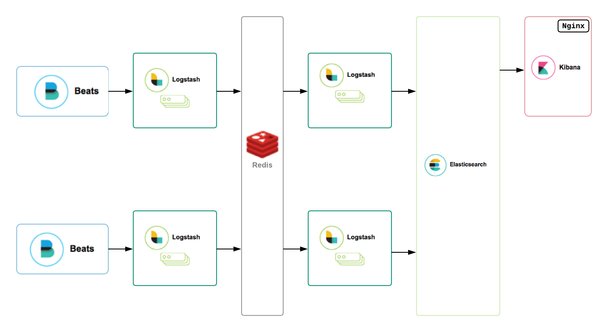

# elk

## Table of Contents

1. [Motivation](#motivation)
2. [Support](#support)
3. [Architecture](#architecture)
4. [About Librarian-puppet & g10k](#about-librarian-puppetg10k)
5. [Reference](#reference)
6. [Testing](#testing)

## Motivation

This project is intended to solve a variety of problems:

* A convenient fully-automated moderately-opinionated out-of-the-box latest-version highly-available ELK solution in Puppet.
* An ELK cluster that spins up conveniently on a single node for development and testing in ELK.
* A demonstration of a complex Puppet Control Repo, Roles & Profiles design with automated testing in Rspec-puppet and Beaker.

## Support

At the time of writing my intention is to support this solution and keep it up-to-date with the latest upstream ELK components and the ELK Puppet modules that it uses. For this reason, the components pulled are always latest-everything (see `Puppetfile`).

If you have any problems with it or wish to request features feel free to raise an issue and I may (or may not) fix or implement. Pull requests also welcome.

## Architecture

The basic architecture is shown in the following figure:

## About Librarian-puppet & g10k

The project is configured to use [librarian-puppet](https://github.com/voxpupuli/librarian-puppet) or [g10k](https://github.com/xorpaul/g10k) to check out the shared modules that this project depends upon.

I prefer Librarian-puppet over r10k for its ability to install dependencies, and I prefer g10k over Librarian-puppet because it has been rewritten in Go and it's just very fast. Librarian-puppet must remain in order to run from within Travis CI. See also the Rakefile.

## Setup

### Quickly build an ELK cluster in Vagrant for development and testing

If your reason for being here is that you just want to play with an ELK cluster, do this:

#### Dependencies

Make sure you have:

* VirtualBox (download from [here](https://www.virtualbox.org/wiki/Downloads))
* Vagrant (download from [here](https://www.vagrantup.com/downloads.html))
* Ruby Gems (should be already installed on a Mac)
* bundler (`gem install bundler`)
* RVM (Ruby version 2.4.1: `rvm install ruby-2.4.1`)
* (optional) Squid Man (`brew install squidman`)

#### Squid Man set up

Squid Man can be optionally used to speed up the Vagrant build by caching a lot of the repetitive downloads of RPMs etc. I assume you are using Squid Man.

Configure Squid Man to listen on port 3128 and cache all.

#### Clone this project

Clone the project from Github:

~~~ text
git clone https://github.com/alexharv074/elk.git
~~~

#### Install dependencies with Bundler

Cd into the elk directory then:

~~~ text
bundle install
~~~

#### Build the Vagrant box

Finally, you can build the ELK cluster using these commands:

~~~ text
export BEAKER_destroy=no
export BEAKER_PACKAGE_PROXY=http://<laptop_ip>:3128/
bundle exec rake best_spec
bundle exec rspec spec/acceptance
~~~

It should then take about 10 minutes or so to build.

Finally, you can visit the ELK at [http://localhost:5601](http://localhost:5601).

## Reference

 - [**Roles**](#roles)
   - [**Public Classes**](#public-classes)
      - [Class: role::elk_stack](#class-roleelk_stack)
 - [**Profiles**](#profiles)
   - [**Public Classes**](#public-classes)
      - [Class: profile::base](#class-profilebase)
      - [Class: profile::elasticsearch::coordinating_node](#class-profileelasticsearchcoordinating_node)
      - [Class: profile::elasticsearch::data_node](#class-profileelasticsearchdata_node)
      - [Class: profile::kibana](#class-profilekibana)
      - [Class: profile::logstash](#class-profilelogstash)
      - [Class: profile::nginx](#class-profilenginx)
      - [Class: profile::redis](#class-profileredis)
   - [**Private Classes**](#private-classes)
      - [Class: profile::jdk](#class-profilejdk)
      - [Class: profile::base::filebeat](#class-profilebasefilebeat)
      - [Class: profile::base::firewall](#class-profilebasefirewall)
      - [Class: profile::base::yum](#class-profilebaseyum)
      - [Class: profile::elasticsearch](#class-profileelasticsearch)

### Note about examples

In all of the examples below, I assume that the user is using Hiera to pass data to the profile classes and only therefore show YAML versions of the config.

### Roles

#### Public Classes

##### Class: `role::elk_stack`

Installs an ELK cluster with a base profile that includes the Filebeat agent and a Redis cache frontended by an Nginx reverse proxy.

The purpose of this role is:

1. To do integration testing in Beaker of all the ELK components.
2. To quickly spin up an ELK cluster for development and testing.

### Profiles

#### Public Classes

##### Class: `profile::base`

The base profile that configures adds the Elastic Filebeat agent, and also an iptables firewall, yum repos both for the ELK and Linux, NTP and other services.

The following parameters are expected:

- `firewall_multis`. A Hash of firewall blocks passed to the firewall_multis module, which creates the iptables rules. For example, to allow ports 23 and 80 for SSH & Kibana:

~~~ yaml
profile::base::firewall_multis:
  '00099 accept tcp ports for SSH and Kibana':
    dport: [22, 80]
    action: accept
    proto: tcp
    source:
      - 0.0.0.0/0
~~~

- `tools`. A Hash of RPMs like `vim` etc for debugging.

##### Class: `profile::elasticsearch::coordinating_node`

Creates a coordinating-only node. Elasticsearch Coordinating-only nodes are essentially smart load balancers and Kibana typically uses one of these to distribute requests to cluster. The class sets `node.master => false`, `node.data => false` and `node.ingest => false` and expects other config to be provided by the user. Also included is the private `profile::elasticsearch` class (see below), which configures the elasticsearch user and group and includes the `profile::jdk`.

The following parameters are expected:

- `firewall_multis`. See above.
- `config`. A Hash of config options that are used to populate the `elasticsearch.yml` file. For example, to set the `cluster.name` and `node.name`:

~~~ yaml
profile::elasticsearch::coordinating_node::config:
  'cluster.name': es01
  'node.name': "es01_coordinating_%{::hostname}"
~~~

- `init_defaults`. A Hash of config options are used to populate the `/etc/sysconfig/defaults` file. For example:

~~~ yaml
profile::elasticsearch::coordinating_node::init_defaults:
  JAVA_HOME: /usr/lib/jvm/java-1.8.0-openjdk-1.8.0.65-0.b17.el6_7.x86_64
~~~

For more information about configuring a coordinating-only node for use with Kibana, see [here](https://www.elastic.co/guide/en/kibana/current/production.html).

##### Class: `profile::elasticsearch::data_node`

Creates a data node (or master-eligible data node). The class sets `node.data => true` and expects other config to be provided by the user. As part of this, there is expected to be a separate physical volume provided via the `espv` fact for the Elasticsearch datadir, and the class creates the LVM and filesystem via the `puppetlabs/lvm` module. Also included is the private `profile::elasticsearch` class (see below), which configures the elasticsearch user and group and includes the `profile::jdk`.

Optional features include:
- Installation of the [curator](https://github.com/elastic/curator) tool, for managing indices (e.g. maintaining disk space).
- Install a list of Elasticsearch templates
- Install a list of Elasticsearch plugins
- Set recommended performance tuning options for the cluster

The following parameters are expected:

- `firewall_multis`. See above.
- `config`. A Hash of config options that are used to populate the `elasticsearch.yml` file. For example, to set the `cluster.name` and `node.name`, and make this data node master-eligible:

~~~ yaml
profile::elasticsearch::data_node::config:
  'cluster.name': es01
  'node.name': "es01_%{::hostname}"
  'node.master': true
~~~

- `init_defaults`. A Hash of config options are used to populate the `/etc/sysconfig/defaults` file. For example:

~~~ yaml
profile::elasticsearch::coordinating_node::init_defaults:
  JAVA_HOME: /usr/lib/jvm/java-1.8.0-openjdk-1.8.0.65-0.b17.el6_7.x86_64
~~~

- `es_templates`. An optional Hash of [Elasticsearch Index Templates](https://www.elastic.co/guide/en/elasticsearch/reference/current/indices-templates.html) which are passed to the `elasticsearch::template` type from the Elasticsearch Puppet module. The templates are expected to be JSON files in your Puppet code base. Example:

~~~ yaml
profile::elasticsearch::data_node::es_templates:
  logstash:
    source: puppet:///modules/profile/logstash/logstash.json
~~~

- `es_plugins`. An optional Hash of Elasticsearch plugins which are passed to the `elasticsearch::plugin` type from the Elasticsearch Puppet module. For example:

~~~ yaml
profile::elasticsearch::data_node::es_plugins:
  'x-pack':
    instances: es01
~~~

- `curator_jobs`. A Hash of jobs passed to the built-in Puppet `cron` type. Example:

~~~ yaml
profile::elasticsearch::data_node::curator_jobs:
  curator_delete:
    command: '/usr/bin/curator --master-only --logfile /var/log/elasticsearch/curator.log delete --older-than 20'
    hour: 2
    minute: 12
  curator_close:
    command: '/usr/bin/curator --master-only --logfile /var/log/elasticsearch/curator.log close --older-than 10'
    hour: 2
    minute: 24
  curator_bloom:
    command: '/usr/bin/curator --master-only --logfile /var/log/elasticsearch/curator.log bloom --older-than 2'
    hour: 2
    minute: 32
~~~

- `datadir`. The full path to the mount point of the data dir.

- `jvm_options`. An Array of JVM options. Example:

~~~ yaml
profile::elasticsearch::data_node::jvm_options:
  - -Xms1g
  - -Xmx1g
~~~

- `config`. A Hash of config options that are used to populate the `elasticsearch.yml` file. For example, to set the `cluster.name` and `node.name`:

~~~ yaml
profile::elasticsearch::coordinating_node::config:
  'cluster.name': es01
  'node.name': "es01_coordinating_%{::hostname}"
~~~

- `init_defaults`. A Hash of config options are used to populate the `/etc/sysconfig/defaults` file. For example:

~~~ yaml
profile::elasticsearch::coordinating_node::init_defaults:
  JAVA_HOME: /usr/lib/jvm/java-1.8.0-openjdk-1.8.0.65-0.b17.el6_7.x86_64
~~~

For more information about configuring a coordinating-only node for use with Kibana, see [here](https://www.elastic.co/guide/en/kibana/current/production.html).

##### Class: `profile::elasticsearch::data_node`

Creates a data node (or master-eligible data node). The class sets `node.data => true` and expects other config to be provided by the user. As part of this, there is expected to be a separate physical volume provided via the `espv` fact for the Elasticsearch datadir, and the class creates the LVM and filesystem via the `puppetlabs/lvm` module.

Optional features include:
- Installation of the [curator](https://github.com/elastic/curator) tool, for managing indices (e.g. maintaining disk space).
- Install a list of Elasticsearch templates
- Install a list of Elasticsearch plugins
- Set recommended performance tuning options for the cluster

The parameters that are expected:

- `firewall_multis`. See above.
- `config`. A Hash of config options that are used to populate the `elasticsearch.yml` file. For example, to set the `cluster.name` and `node.name`, and make this data node master-eligible:

~~~ yaml
profile::elasticsearch::data_node::config:
  'cluster.name': es01
  'node.name': "es01_%{::hostname}"
  'node.master': true
~~~

- `init_defaults`. A Hash of config options are used to populate the `/etc/sysconfig/defaults` file. For example:

~~~ yaml
profile::elasticsearch::coordinating_node::init_defaults:
  JAVA_HOME: /usr/lib/jvm/java-1.8.0-openjdk-1.8.0.65-0.b17.el6_7.x86_64
~~~

- `es_templates`. An optional Hash of [Elasticsearch Index Templates](https://www.elastic.co/guide/en/elasticsearch/reference/current/indices-templates.html). The templates are expected to be JSON files in your Puppet code base. Example:

~~~ yaml
profile::elasticsearch::data_node::es_templates:
  logstash:
    source: puppet:///modules/profile/logstash/logstash.json
~~~

##### Class: `profile::kibana`

The Kibana profile is just a thin wrapper around the Elastic Kibana module. The module accepts just three parameters:

- `firewall_multis`. See above.
- `uid` and `gid`. The UID and GID of the Kibana user and group. We manage it explicitly to avoid the indeterminate assignment that occurs when created by the RPMs. Integers >= 30000 are expected here.

Config can be passed to the Kibana module directly, for example:

~~~ yaml
kibana::config:
  'server.host': 0.0.0.0
  'server.port': 5601
  'elasticsearch.url': http://0.0.0.0:9201
~~~

##### Class: `profile::nginx`

The Nginx profile can be used to create a simple Reverse Proxy to place in front of Kibana so that users can access Kibana on port 80 in their browsers, rather than Kibana port 5601.

Expected parameters:

- `firewall_multis`. See above.
- `uid` and `gid`. The UID and GID of the Logstash user and group. We manage it explicitly to avoid the indeterminate assignment that occurs when created by the RPMs. Integers >= 30000 are expected here.
- `backend_host` and `backend_port`. The host and port of the Kibana service.

##### Class: `profile::logstash`

The Logstash profile is used to configure Logstash instances such as Logstash Shipper or Indexer nodes or both or other kinds of Logstash nodes. It configures Logstash itself via the Elastic Puppet Logstash module, declares `logstash::configfile` and `logstash::patternfiles` from that module, creates the Logstash user and group, and installs the JDK package.

Logstash Pipelines can be declared by passing data directly to the Logstash module. Note that since ELK 6.x, the [Multiple Pipelines](https://www.elastic.co/guide/en/logstash/current/multiple-pipelines.html) feature has obviated the need in earlier versions of ELK for multiple Logstash instances, e.g. separate Shipper and Indexer nodes. To run Shipper and Indexer Pipelines in the same instance, for example:

~~~ yaml
logstash::pipelines:
  - 'pipeline.id': shipper
    'path.config': /etc/logstash/conf.d/shipper.conf
  - 'pipeline.id': indexer
    'path.config': /etc/logstash/conf.d/indexer.conf
~~~

The following parameters are expected by the Logstash profile:

- `firewall_multis`. See above.
- `uid` and `gid`. The UID and GID of the Logstash user and group. We manage it explicitly to avoid the indeterminate assignment that occurs when created by the RPMs. Integers >= 30000 are expected here.
- `configfiles`. A Hash of `logstash::configfile`. For example:

~~~ yaml
profile::logstash::configfiles:
  'shipper.conf':
    source: puppet:///modules/profile/logstash/conf.d/shipper.conf
    path: /etc/logstash/conf.d/shipper.conf
  'indexer.conf':
    source: puppet:///modules/profile/logstash/conf.d/indexer.conf
    path: /etc/logstash/conf.d/indexer.conf
~~~

- `patternfiles`. A Hash of `logstash::patternfile`.

#### Private Classes

##### Class: `profile::jdk`

This profile just installs the Open JDK package. It expects one parameter, the package name. For example:

~~~ yaml
profile::jdk::package: java-1.8.0-openjdk
~~~

##### Class: `profile::base::filebeat`

Includes the (official) Pcfens/Filebeat class and also declares a `filebeat::prospector`. There is one expected parameter:

- `paths`. An Array of file paths to send logs for. Example:

~~~ yaml
profile::base::filebeat::paths:
  - /var/log/syslog
  - /var/log/secure
~~~

##### Class: `profile::base::firewall`, `profile::base::firewall::pre`, `profile::base::firewall::post`

These classes configure the Puppetlabs Firewall module in the standard way according to documentation found at that project.

##### Class: `profile::base::yum`

All Yum repos - including for the Elasticsearch components - are managed from here. I designed it this way because I wanted to use the Puppet "purge" feature to ensure that I have control over Yum repos left in here by the Linux distro.

- `repos`. A Hash of Yum Repos. Example:

~~~ yaml
profile::base::yum::repos:
  'ELK-6.x':
    descr: 'elasticsearch repo'
    baseurl: https://artifacts.elastic.co/packages/6.x/yum
    gpgcheck: 1
    gpgkey: https://artifacts.elastic.co/GPG-KEY-elasticsearch
    enabled: 1
~~~

##### Class: `profile::elasticsearch`

This class configures the Elasticsearch user and group and also includes the Elasticsearch Puppet module itself. The only expected parameters are the `uid` and `gid` (see above for these).

## Testing

### Dependencies

Make sure you have:

* VirtualBox (or equivalent)
* Vagrant
* Ruby Gems
* bundler
* RVM
* Squid Man

### Squid Man set up

Configure Squid Man to listen on port 3128 and cache all.

### Run the tests

Install the necessary gems:

~~~ text
bundle install
~~~

To run the unit tests from the root of the source code:

~~~ text
bundle exec rake best_spec
~~~

To run the acceptance tests:

~~~ text
ipaddr=$(ifconfig en0 | awk '/inet/ {print $2}')
export BEAKER_PACKAGE_PROXY=http://${ipaddr}:3128/
~~~

Puppet 5.5.1:

~~~ text
export BEAKER_PUPPET_COLLECTION=puppet5
export BEAKER_PUPPET_INSTALL_VERSION=5.5.1
~~~

Puppet 4.10.11:

~~~ text
export BEAKER_PUPPET_COLLECTION=pc1
export BEAKER_PUPPET_INSTALL_VERSION=1.10.12
~~~

Then:

~~~ text
bundle exec rspec spec/acceptance
~~~

Tested using Puppet 4.10.11, 5.5.1 and Ruby 2.4.1.
